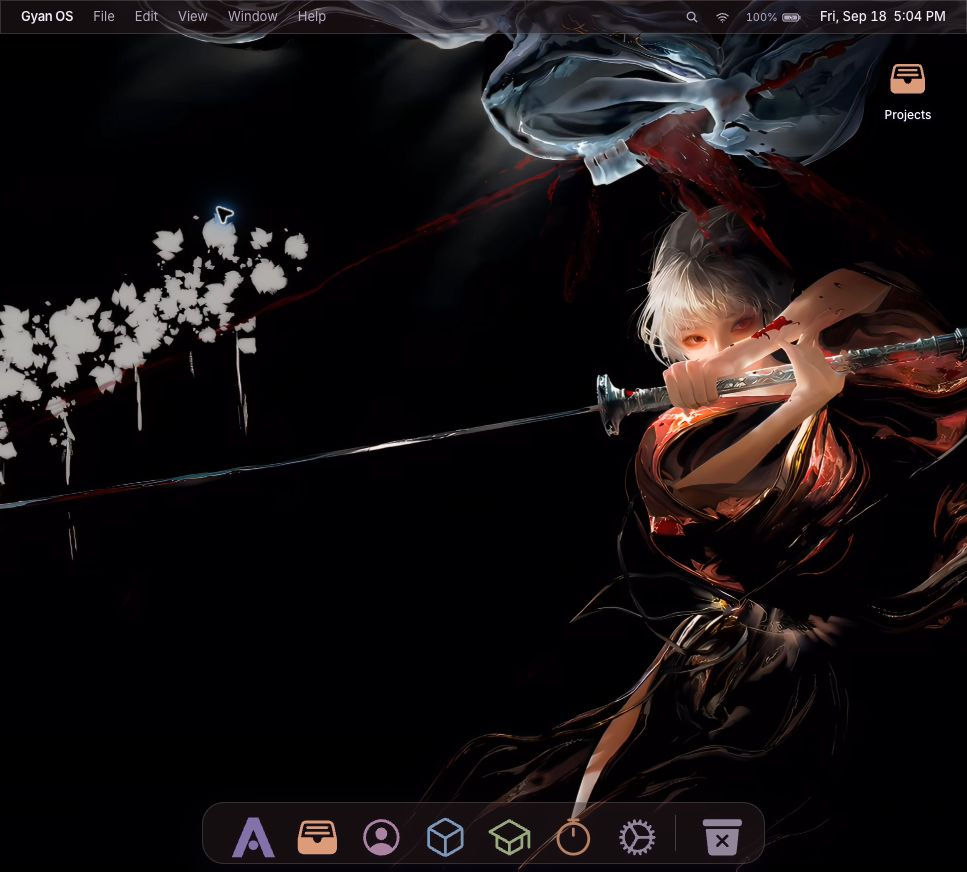
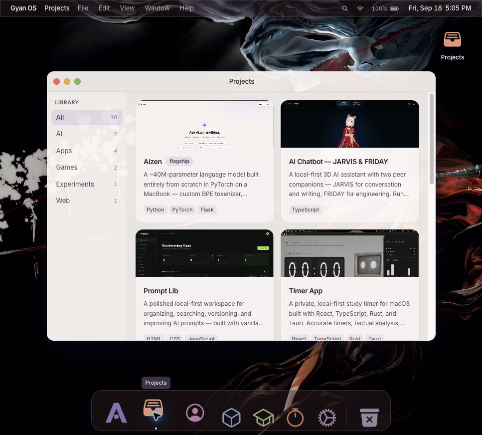

# Gyan OS

Gyan Kashyap’s portfolio, presented as an interactive desktop in your browser.
Open apps from the dock, explore projects, read about the work, or use the study
timer. **Aizen is a local model demo. No hosted backend or website deployment is
configured.**



## Run locally

Requires **Node.js 24+** and npm.

```sh
git clone https://github.com/GyanxKashyap/gyan-os.git
cd gyan-os
npm ci
npm run dev
```

Open **http://127.0.0.1:5173**. Keep using the same address and port to retain the
same browser storage. Stop the server with `Ctrl+C`.

The portfolio works without a model server. For live Chat and Story, follow the
[Aizen local demo guide](docs/AIZEN_LOCAL_DEMO.md).

## Explore

| App | What you can do |
| --- | --- |
| Aizen | Try local Chat and Story; inspect model details, benchmark results and training history |
| Projects | Browse 10 projects, supplied screenshots, source links and verified demo links |
| About Me | Read Gyan’s profile, skills, journey and interests |
| Lab | Explore recorded training phases, loss curves, versions and datasets |
| Knowledge | Read project notes by category |
| Timer | Run countdown/open sessions, review study history and keep notes locally |
| Settings | Choose wallpapers, motion preferences, dock behavior and check Aizen’s connection |

Trash is a decorative desktop app; it does not manage your computer’s files.



## Desktop controls

- Click a dock icon to open or restore an app. Double-click the desktop Projects
  icon with a mouse, or tap it on a touch device.
- Drag a title bar to move a window and its bottom-right corner to resize it.
- Red closes, yellow minimizes, and green maximizes/restores a window. Minimizing
  preserves the app’s current state; closing resets transient views and drafts.
- Use Search or `⌘K` / `Ctrl+K` to find apps, projects and notes. Arrow keys select
  a result, Enter opens it, and Escape closes search.
- Window menu actions provide minimize, zoom and close controls. Browsers may
  reserve `⌘W`/`Ctrl+W`; use the red button when that shortcut closes a browser tab.
- On narrow/touch screens the dock stays visible and scrolls sideways. Category
  and tab strips scroll when needed.

**Samurai Crimson Gaze** is the default wallpaper for fresh installs. Existing
saved choices remain intact. Turn off Live wallpaper or Animations for its still
image; system reduced-motion preferences also take precedence.

## Data and privacy

Settings use `localStorage`. Custom wallpapers and Timer records use IndexedDB.
Data stays in the current browser profile and origin, without accounts or cloud
sync. Clearing site data removes it. Chat drafts and window layout are transient.
Chat/Story requests go to the separately running local Aizen server. The default
wallpaper is bundled; Inter is requested from Google Fonts with system fallbacks.

## Development checks

```sh
npm test
npm run lint
npm run build
npm run preview
```

Tests exercise window geometry/focus, streaming UTF-8 and backend failures, and
Timer recovery/accounting. The production build goes to `dist/`. Preview serves
it locally; it does not publish a site. CI runs checks only, without deployment.

## Documentation

- [Local Aizen setup and troubleshooting](docs/AIZEN_LOCAL_DEMO.md)
- [Architecture and persistence](docs/ARCHITECTURE.md)
- [Editing content, screenshots and wallpapers](docs/CONTENT_GUIDE.md)
- [Verification and your review checklist](docs/TESTING.md)
- [Asset credits](docs/ASSETS.md)
- [Contributing](CONTRIBUTING.md) · [Changelog](CHANGELOG.md)

## License

Source code is under [MIT](LICENSE). Media assets and depicted third-party
projects retain their respective rights; see [asset credits](docs/ASSETS.md).
